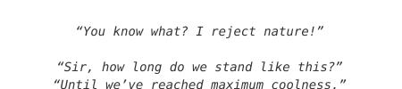

🤓 **About me**

- 🏫 Undergraduate in Computer Science @USTB
- 🧩 Currently learning systems programming and AISys
- ✨ No free lunch though, I want to find a cheaper one.
- 📮 How to reach me: zhoubencheng2022@163.com


📊 **This month I spent my time on**
<!--START_SECTION:waka-->

```txt
From: 12 August 2025 - To: 11 September 2025

C++           29 hrs 59 mins  ████████████████▓░░░░░░░░   66.44 %
C             6 hrs 32 mins   ███▓░░░░░░░░░░░░░░░░░░░░░   14.48 %
Other         2 hrs 44 mins   █▓░░░░░░░░░░░░░░░░░░░░░░░   06.09 %
Markdown      2 hrs 26 mins   █▒░░░░░░░░░░░░░░░░░░░░░░░   05.42 %
Rust          1 hr            ▓░░░░░░░░░░░░░░░░░░░░░░░░   02.23 %
```

<!--END_SECTION:waka-->

<div align="left">
	<code></code>
	<code></code>
	<code></code>
	<code></code>
	<code></code>
	<code></code>
	<code></code>
	<code></code>
	<code></code>
	<code></code>
</div>

<table>
    <tr>
        <td>
        <a href="https://github.com/anuraghazra/github-readme-stats">
            
        </a>
        </td>
        <td>
            <a href="https://github.com/anuraghazra/github-readme-stats">
                
            </a>
        </td>
    </tr>
    <tr>
        <td valign="middle" width="60%">
            
        </td>
        <td valign="middle">
            
        </td>
    </tr>
</table>

<a href="https://stackoverflow.com/users/25302360/benson">
  
</a>

<a href="https://leetcode.cn/u/ben-a63/">
  
</a>

<a href="https://www.zhihu.com/people/zzz-14-25-34">
  
</a>
